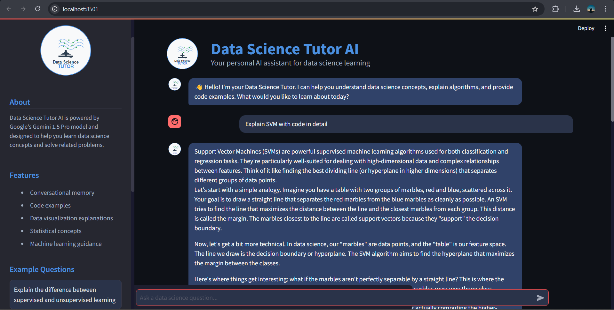

# Data Science Tutor AI

A conversational AI tutor built with **Streamlit** and powered by **Google's Gemini 1.5 Pro model** to help users learn data science concepts and solve related problems interactively.




## 🚀 Features

- **Conversational AI** that maintains discussion memory.
- **Specialized in Data Science** topics.
- **Interactive Chat Interface** with example questions.
- **Code Examples & Explanations** for better understanding.
- **Session Persistence** for a continuous learning experience.
- **Styled Code Blocks** for readability.
- **Typing Animation** for natural interaction.

## 📥 Installation

### 1️⃣ Clone the Repository
```bash
git clone https://github.com/mohammeddaniyaalullahkhan/Data_Science_Tutor.git
cd data-science-tutor
```

### 2️⃣ Install Dependencies
```bash
pip install -r requirements.txt
```

### 3️⃣ Set Up API Key
Create a `.env` file in the root directory and add your **Google API Key**:
```ini
GOOGLE_API_KEY=your_api_key_here
```

## 🏃‍♂️ Usage
Run the Streamlit app:
```bash
streamlit run app.py
```
The app will be available at **`http://localhost:8501`** in your web browser.

## 📂 Project Structure

```
data_science_tutor/
├── app.py                  # Main Streamlit application file
├── requirements.txt        # Dependencies
├── README.md               # Project documentation
├── .gitignore              # Git ignore file
├── utils/
│   ├── __init__.py
│   ├── conversation.py     # Conversation management
│   ├── memory_handler.py   # Memory management
│   └── gemini_handler.py   # Gemini model integration
├── components/
│   ├── __init__.py
│   ├── sidebar.py          # Sidebar UI component
│   └── chat_interface.py   # Chat UI component
└── static/
    ├── css/
    │   └── style.css       # Custom styling
    └── img/
        └── logo.svg       # App logo
```

## 📌 Additional Features

- **Conversation Memory**: Retains chat history during a session.
- **Quick Learning Questions**: Example queries for instant insights.
- **Conversation Reset**: Clear chat history anytime.
- **Modern UI/UX**: Intuitive and responsive design.

## 📦 Dependencies

- **Streamlit** - Web app framework.
- **LangChain** - Enables LLM-based applications.
- **Google Generative AI (Gemini 1.5 Pro)** - Core AI model.
- **Python-dotenv** - Environment variable management.
- **Streamlit-chat** - Custom chat interface for Streamlit.

## 📜 License

This project is licensed under the **MIT License**.

## 📞 Contact

For any queries or contributions, reach out via:
- **Email**: er.mohammeddaniyaalullahkhan@gmail.com
- **LinkedIn**: [Daniyaalullah](www.linkedin.com/in/daniyaalullah-khan-mohammed-70043620b)

